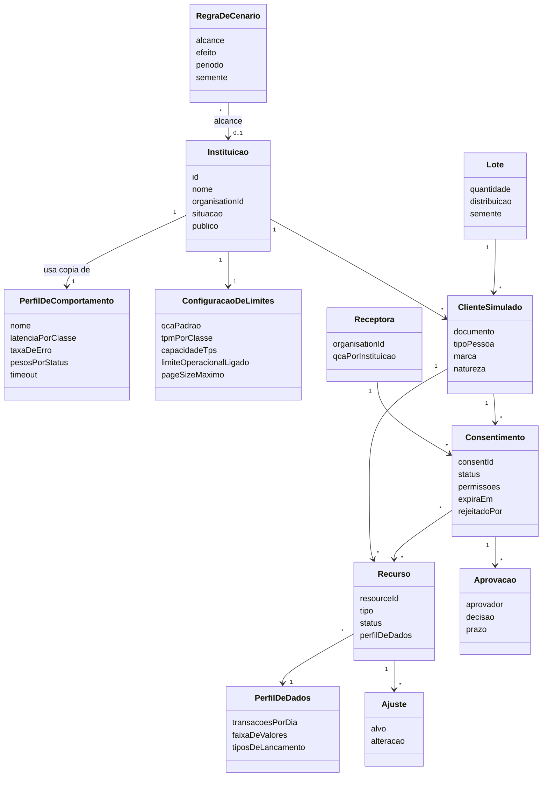
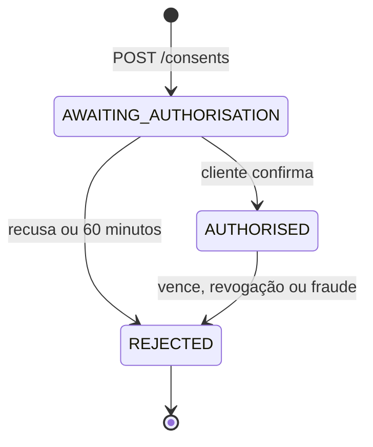
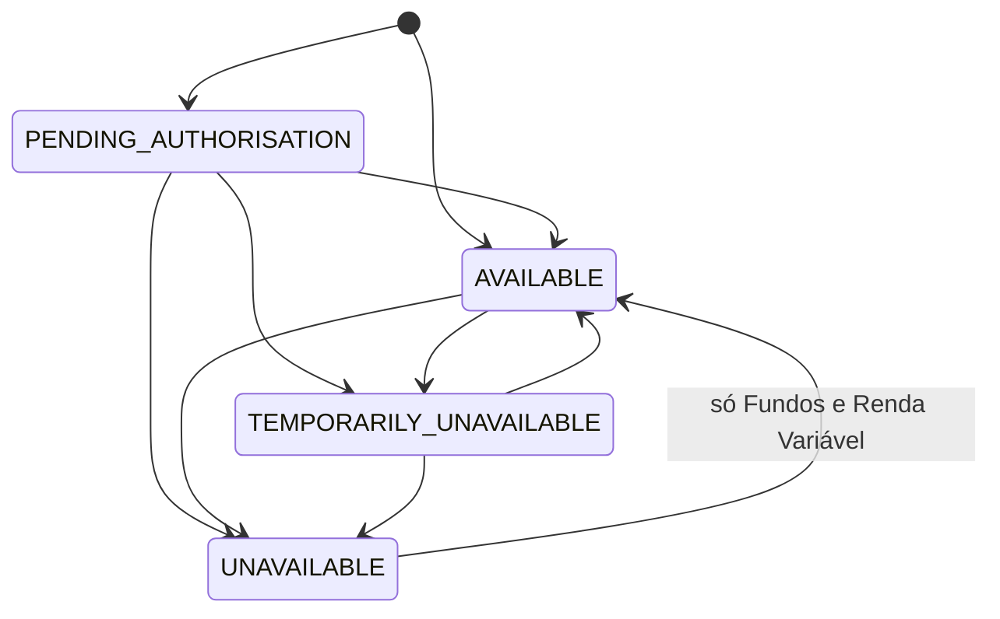

# Modelo de domínio

Relacionados: [glossário](../../01-requisitos/glossario.md) · [modelo de dados](../../04-dados/modelo-de-dados.md)

```mermaid
classDiagram
  class Instituicao {
    id
    nome
    organisationId
    situacao
    publico
  }
  class PerfilDeComportamento {
    nome
    latenciaPorClasse
    taxaDeErro
    pesosPorStatus
    timeout
  }
  class ConfiguracaoDeLimites {
    qcaPadrao
    tpmPorClasse
    capacidadeTps
    limiteOperacionalLigado
    pageSizeMaximo
  }
  class Receptora {
    organisationId
    qcaPorInstituicao
  }
  class ClienteSimulado {
    documento
    tipoPessoa
    marca
    natureza
  }
  class Consentimento {
    consentId
    status
    permissoes
    expiraEm
    rejeitadoPor
  }
  class Recurso {
    resourceId
    tipo
    status
    perfilDeDados
  }
  class Aprovacao {
    aprovador
    decisao
    prazo
  }
  class PerfilDeDados {
    transacoesPorDia
    faixaDeValores
    tiposDeLancamento
  }
  class Ajuste {
    alvo
    alteracao
  }
  class RegraDeCenario {
    alcance
    efeito
    periodo
    semente
  }
  class Lote {
    quantidade
    distribuicao
    semente
  }

  Instituicao "1" --> "1" PerfilDeComportamento : usa copia de
  Instituicao "1" --> "1" ConfiguracaoDeLimites
  Instituicao "1" --> "*" ClienteSimulado
  Receptora "1" --> "*" Consentimento
  ClienteSimulado "1" --> "*" Consentimento
  ClienteSimulado "1" --> "*" Recurso
  Consentimento "*" --> "*" Recurso
  Consentimento "1" --> "*" Aprovacao
  Recurso "*" --> "1" PerfilDeDados
  Recurso "1" --> "*" Ajuste
  Lote "1" --> "*" ClienteSimulado
  RegraDeCenario "*" --> "0..1" Instituicao : alcance
```

## Máquinas de estados

### Consentimento

```mermaid
stateDiagram-v2
  [*] --> AWAITING_AUTHORISATION : POST /consents
  AWAITING_AUTHORISATION --> AUTHORISED : cliente confirma
  AWAITING_AUTHORISATION --> REJECTED : recusa ou 60 minutos
  AUTHORISED --> REJECTED : vence, revogação ou fraude
  REJECTED --> [*]
```

### Recurso

```mermaid
stateDiagram-v2
  [*] --> PENDING_AUTHORISATION
  [*] --> AVAILABLE
  PENDING_AUTHORISATION --> AVAILABLE
  PENDING_AUTHORISATION --> TEMPORARILY_UNAVAILABLE
  PENDING_AUTHORISATION --> UNAVAILABLE
  AVAILABLE --> TEMPORARILY_UNAVAILABLE
  AVAILABLE --> UNAVAILABLE
  TEMPORARILY_UNAVAILABLE --> AVAILABLE
  TEMPORARILY_UNAVAILABLE --> UNAVAILABLE
  UNAVAILABLE --> AVAILABLE : só Fundos e Renda Variável
```
