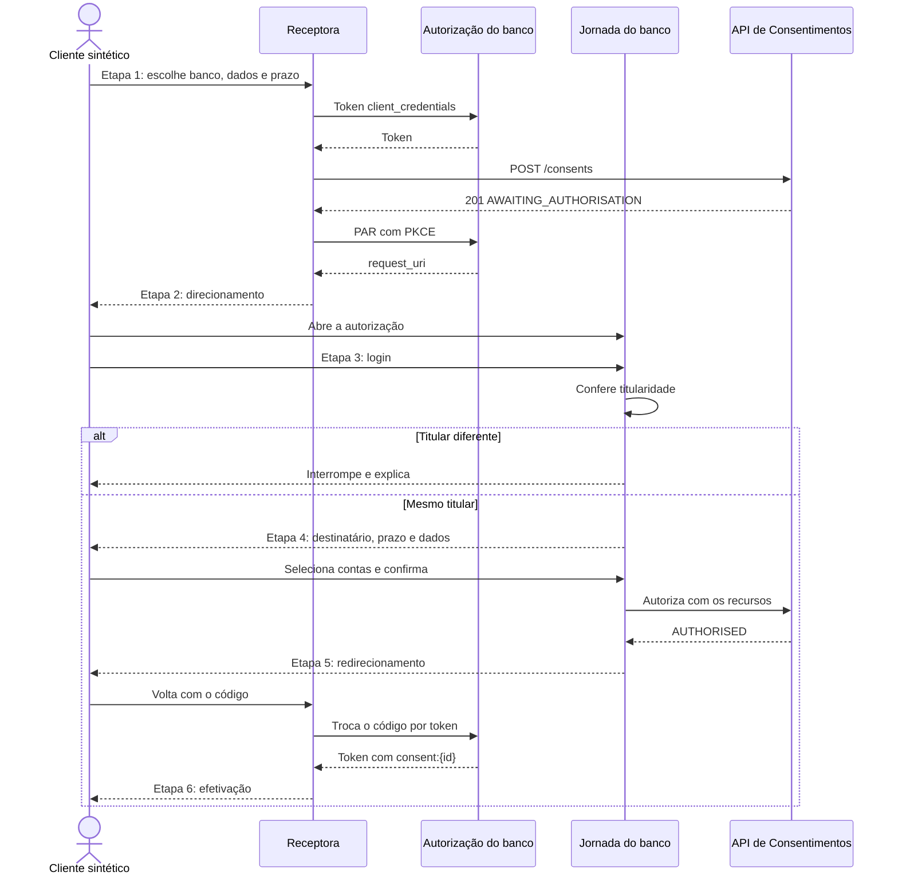

# 01 — Jornada de consentimento

Etapas do [Guia de Experiência](../../00-visao-geral/referencias.md#f10). O modo FAPI usa PAR e PKCE ([RN121](../../01-requisitos/regras-de-negocio.md#rn121)).

```mermaid
sequenceDiagram
  actor C as Cliente sintético
  participant R as Receptora
  participant A as Autorização do banco
  participant J as Jornada do banco
  participant S as API de Consentimentos

  C->>R: Etapa 1: escolhe banco, dados e prazo
  R->>A: Token client_credentials
  A-->>R: Token
  R->>S: POST /consents
  S-->>R: 201 AWAITING_AUTHORISATION
  R->>A: PAR com PKCE
  A-->>R: request_uri
  R-->>C: Etapa 2: direcionamento
  C->>J: Abre a autorização
  C->>J: Etapa 3: login
  J->>J: Confere titularidade
  alt Titular diferente
    J-->>C: Interrompe e explica
  else Mesmo titular
    J-->>C: Etapa 4: destinatário, prazo e dados
    C->>J: Seleciona contas e confirma
    J->>S: Autoriza com os recursos
    S-->>J: AUTHORISED
    J-->>C: Etapa 5: redirecionamento
    C->>R: Volta com o código
    R->>A: Troca o código por token
    A-->>R: Token com consent:{id}
    R-->>C: Etapa 6: efetivação
  end
```
