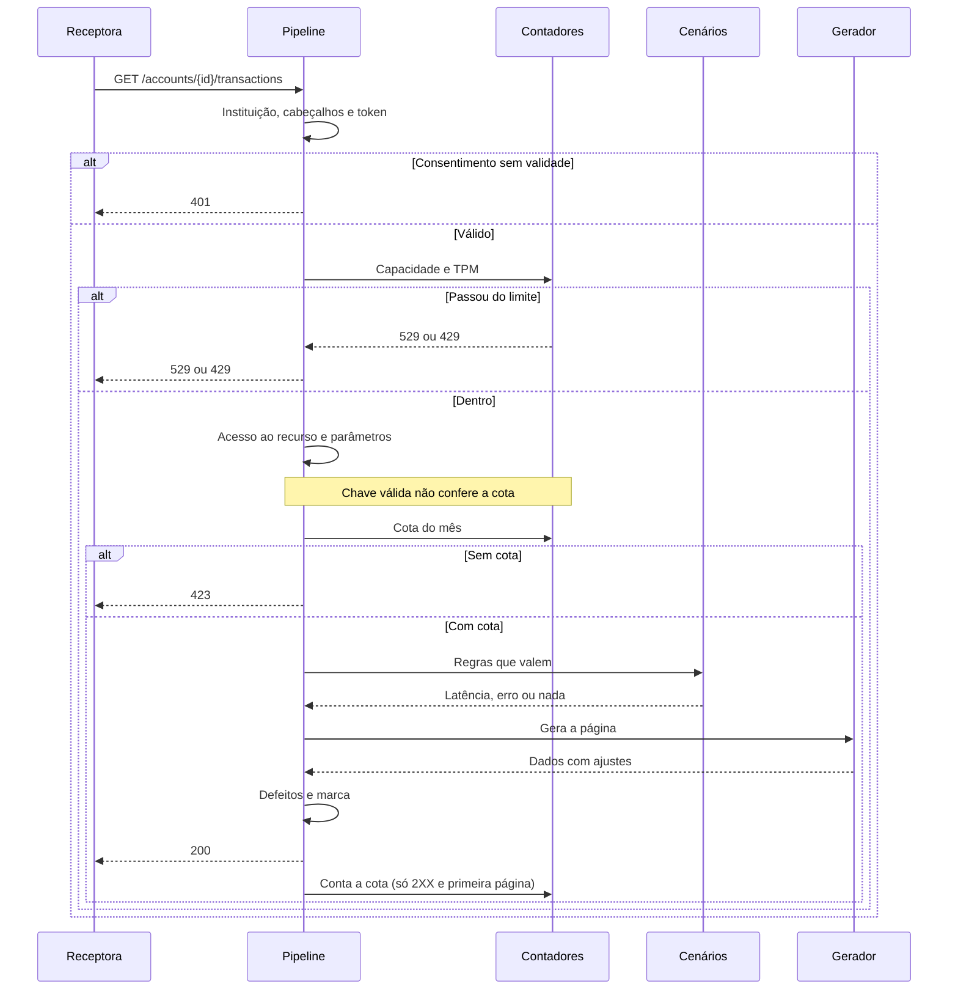

# 02 — Chamada de dados

```mermaid
sequenceDiagram
  participant R as Receptora
  participant P as Pipeline
  participant L as Contadores
  participant C as Cenários
  participant G as Gerador

  R->>P: GET /accounts/{id}/transactions
  P->>P: Instituição, cabeçalhos e token
  alt Consentimento sem validade
    P-->>R: 401
  else Válido
    P->>L: Capacidade e TPM
    alt Passou do limite
      L-->>P: 529 ou 429
      P-->>R: 529 ou 429
    else Dentro
      P->>P: Acesso ao recurso e parâmetros
      Note over P,L: Chave válida não confere a cota
      P->>L: Cota do mês
      alt Sem cota
        P-->>R: 423
      else Com cota
        P->>C: Regras que valem
        C-->>P: Latência, erro ou nada
        P->>G: Gera a página
        G-->>P: Dados com ajustes
        P->>P: Defeitos e marca
        P-->>R: 200
        P->>L: Conta a cota (só 2XX e primeira página)
      end
    end
  end
```
