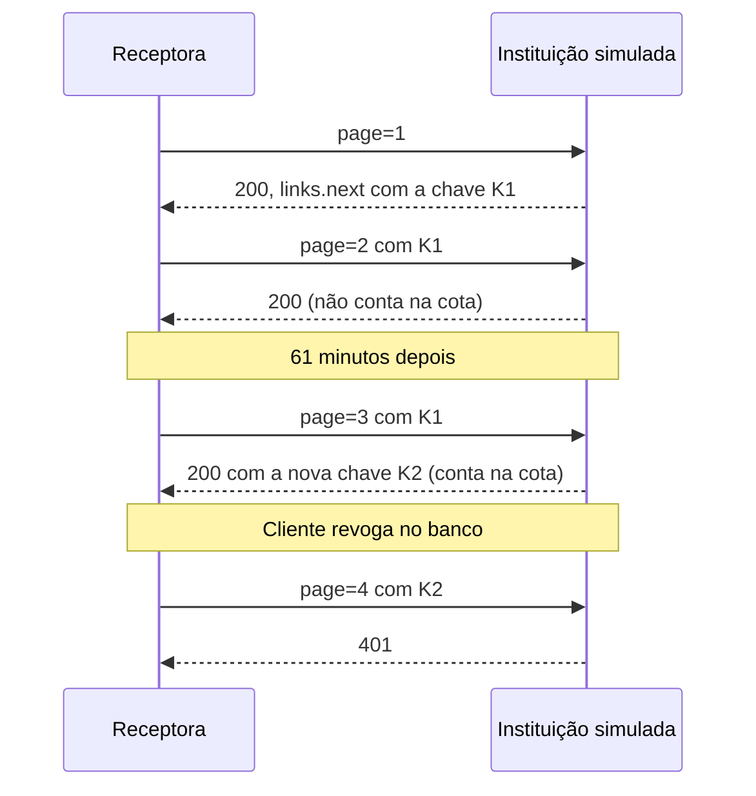

# 03 — Coleta paginada com falha

Mostra a situação que mais interessa à receptora: a chave vence no meio da coleta e, depois, o consentimento cai.

```mermaid
sequenceDiagram
  participant R as Receptora
  participant S as Instituição simulada

  R->>S: page=1
  S-->>R: 200, links.next com a chave K1
  R->>S: page=2 com K1
  S-->>R: 200 (não conta na cota)
  Note over R,S: 61 minutos depois
  R->>S: page=3 com K1
  S-->>R: 200 com a nova chave K2 (conta na cota)
  Note over R,S: Cliente revoga no banco
  R->>S: page=4 com K2
  S-->>R: 401
```
