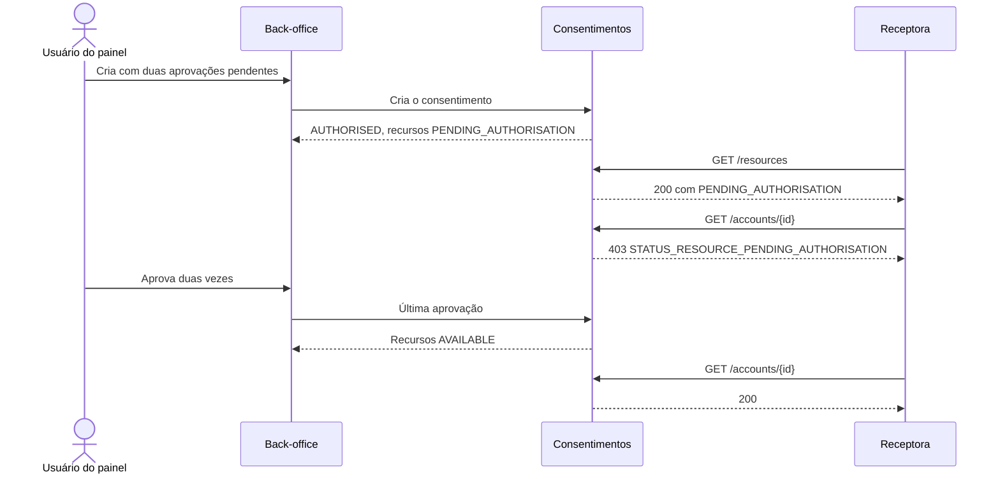

# 04 — Múltiplas alçadas

```mermaid
sequenceDiagram
  actor U as Usuário do painel
  participant B as Back-office
  participant S as Consentimentos
  participant R as Receptora

  U->>B: Cria com duas aprovações pendentes
  B->>S: Cria o consentimento
  S-->>B: AUTHORISED, recursos PENDING_AUTHORISATION
  R->>S: GET /resources
  S-->>R: 200 com PENDING_AUTHORISATION
  R->>S: GET /accounts/{id}
  S-->>R: 403 STATUS_RESOURCE_PENDING_AUTHORISATION
  U->>B: Aprova duas vezes
  B->>S: Última aprovação
  S-->>B: Recursos AVAILABLE
  R->>S: GET /accounts/{id}
  S-->>R: 200
```
